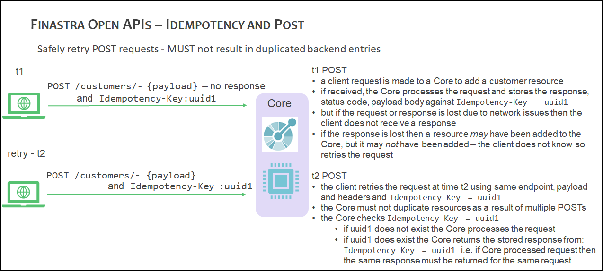

# Idempotency
{: .no_toc}

This section describes the concept of idempotency for REST APIs and the implications for Finastra APIs.

- TOC
{:toc}

## Idempotency and REST APIs

In the context of REST APIs idempotency refers to the capability of a
system to safely retry identical requests without performing the same
operation twice so that making multiple identical requests has the
same effect as making a single request.

An idempotent solution is necessary
when HTTP is used as a transport mechanism because network failures do
occur and responses are lost, albeit infrequently. Hence, the
ability to retry requests safely adds resiliency to the system. For
example, if the response to a payment request is not received by a
client then if the server has implemented idempotency the client can
safely retry the request without making the payment twice.

The following list indicates the idempotent characteristics of HTTP methods:

-   GET, PUT, HEAD, TRACE and OPTIONS methods are idempotent since multiple,
    identical requests have the same impact on a resource
-   DELETE can pragmatically be seen as idempotent since the server
    state is unchanged following identical requests
-   POST is **NOT** idempotent since repeated requests create a new
    resource and return a unique resource identifier for each request

The following diagram provides an overview of an idempotency solution whereby the 
duplication of a resource is avoided when a POST is attempted at time t1 and again
at a later time t2: 




## Client Perspective

Finastra APIs should be designed to ensure that POST requests are
idempotent - this is done by the client specifying the following HTTP
header when making POST requests:

-   `Idempotency-Key` - this HTTP header field is a string that contains
    a unique idempotency key, ideally a v4 UUID.

When performing a request, a client generates a unique ID ``idempotency-key`` to identify the request and sends it to the server with the payload.

The server receives the request and correlates the idempotency key with the state of the request on its end.

If the client notices a failure, it retries the request with the same idempotency key, and from there it is up to the server to figure out what to do with it.

## Server Perspective

Where idempotency is implemented, the backend server must save the
status code and body of the response against the idempotency key,
regardless of whether it succeeded or failed. Subsequent requests with
the same key must then return this stored response. Note that the
response is only stored if the backend started processing the request as
part of a transaction.

The backend server must also consider the following implementation
details:

-   The ```Idempotency-Key``` provided in the header must be at most 40 characters in size. 
    If a larger Idempotency-Key length is provided, the server must reject the request 
    with a status code is 400 (Bad Request).
-   The Identity provider must not change the request body while using the same ```Idempotency-Key```. 
    If the Identity provider changes the request body, the server must not modify the end resource. 
    The server may treat this as a fraudulent action.
-   The value of the `Idempotency-Key` can be the same value as an
    existing payload field as long as the payload field is guaranteed to
    be unique.
-   The server must treat a request as idempotent if it had received the first request with the same ```Idempotency-Key``` 
    from the same Identity provider in the preceding 24 hours.
-   Publish the longevity of idempotency keys - keys are typically
    purged after 24 hours.
-   To ensure that the client is not generating duplicated idempotency
    keys, it may be beneficial to compare incoming request payloads with
    stored request payloads and return an error if they differ.
-   The `Idempotency-Key` header is not the same as the `X-Request-Id`
    header.
-   The server must not create a new resource for a POST request if it is determined to be an idempotent request.
-   The server must respond to the request with the current status of the resource (or a status which is at least
    as current as what's available on existing online channels) and a HTTP status code of 201 (Created).
-   The Identity provider must not use the idempotent behavior to poll the status of resources.
-   The server may use the message signature, along with the Idempotency-Key to ensure that the request body has not changed.


## Finastra Idempotency Standards

The implementation of idempotency using `Idempotency-Key` is not
mandatory for all APIs since it imposes strict rules on the client and
server, however, full consideration of the implications of NOT
implementing idempotency must be considered, hence:

> Idempotency **MUST** be considered for all API requests

> Finastra APIs **SHOULD** support idempotency for POST methods

> Finastra APIs supporting idempotency **MUST** define an
> \`Idempotency-Key header on associated POST operations

**Sample API Code**

The following code snippet shows a sample OAS2 definition of a POST operation within a
Finastra API that supports idempotency:
```
 post:
	parameters:
	  - name: Idempotency-Key
		 in: header
		 description: Idempotency key will be valid for 24 hours
		 type: string
		 required: true
```

References:

* [IETF Idempotency draft](https://tools.ietf.org/id/draft-idempotency-header-01.html)
